# MLOps Sentiment Analysis – Online Reputation Monitoring

**Machine Innovators Inc.** – Piattaforma di monitoraggio del sentiment online con ritraining automatico, MLflow registry e dashboard di monitoring in tempo reale.

> **Modello**: [cardiffnlp/twitter-roberta-base-sentiment-latest](https://huggingface.co/cardiffnlp/twitter-roberta-base-sentiment-latest) (RoBERTa fine-tuned per sentiment su Twitter)
>
> **Nota sulla traccia**: La traccia dell'esame menziona FastText, ma il modello indicato nel link è RoBERTa. Il progetto utilizza il modello HuggingFace linkato per migliore accuracy su testi brevi e social media.

---

## 🚀 Quick Start (5 minuti)

### Requisiti
- **Docker** e **Docker Compose** (v2.0+)
- **Python 3.10+** (opzionale, solo per esecuzione locale senza container)

### Avvia lo stack completo
```bash
# Clone e avvia
git clone https://github.com/ev91/MachineInnovators_Inc_ProAI.git
cd MachineInnovators_Inc_ProAI

# Prepara variabili d'ambiente (opzionale, usa i default)
# cp .env.example .env

# Avvia il stack
./scripts/up.sh --build
# Oppure manualmente: docker compose up --build
```

**Attendi ~60–90 secondi** finché tutti i servizi sono `running`:
```
✓ app (FastAPI)              → http://localhost:8000
✓ mlflow (Model Registry)    → http://localhost:5000
✓ airflow (Orchestration)    → http://localhost:8080
✓ prometheus (Metrics DB)    → http://localhost:9090
✓ grafana (Dashboards)       → http://localhost:3000
```

### Test rapido dell'API
```bash
# Health check
curl http://localhost:8000/health

# Predizione di sentiment
curl -X POST http://localhost:8000/predict \
  -H 'Content-Type: application/json' \
  -d '{"text": "I love this product!"}'
```

---

## 📖 Documentazione

### Per sviluppatori/valuatori
1. **[Panoramica della codebase](docs/codebase_overview.md)** – Architettura, componenti, flusso dati
2. **[Metriche e Monitoring](docs/metrics_guide.md)** – Come leggere Prometheus/Grafana
3. **[Training e Promozione Modello](docs/training_and_promotion.md)** – Flusso MLflow, retraining
4. **[Simulazione Data Drift](docs/data_drift_simulation.md)** – Come testare il rilevamento drift
5. **[Delivery Status](docs/DELIVERY_STATUS.md)** – Checklist consegna, componenti implementati, stato progetto

---

## ⚙️ Configurazione

### Variabili d'ambiente

Tutte le porte e i percorsi dei modelli sono configurabili. Crea un file `.env` dal template:

```bash
cp .env.example .env
```

Variabili principali:

| Variabile | Default | Descrizione |
|-----------|---------|-------------|
| `APP_PORT` | 8000 | Porta FastAPI |
| `MLFLOW_PORT` | 5000 | Porta MLflow UI |
| `AIRFLOW_PORT` | 8080 | Porta Airflow UI |
| `PROM_PORT` | 9090 | Porta Prometheus |
| `PUSHGATEWAY_PORT` | 9091 | Porta Pushgateway |
| `GRAFANA_PORT` | 3000 | Porta Grafana |
| `MODEL_URI` | _(vuoto)_ | URI MLflow (es. `models:/Sentiment/Production`) per servire il modello in Produzione |
| `REGISTERED_MODEL_NAME` | `Sentiment` | Nome del modello nel registry MLflow |

Per dettagli completi vedi [.env.example](.env.example).

---

## 📊 Componenti dello stack

### FastAPI (Serving)
Espone tre endpoint principali:
- **`GET /health`** – Health check (ritorna `{"status": "ok"}`)
- **`POST /predict`** – Classifica sentiment (input: `{"text": "..."}`, output: `{"label": "positive|neutral|negative", "score": 0.0-1.0}`)
- **`GET /metrics`** – Metriche Prometheus in formato standard

Carica il modello dal registry MLflow (se `MODEL_URI` è impostato) oppure fallback automatico su HuggingFace.

### MLflow (Model Registry)
Gestisce le versioni del modello, stage (Production/Staging) e artefatti.
- **UI**: http://localhost:5000
- Credenziali: opzionali (default: nessuna autenticazione)

### Airflow (Orchestration)
DAG `retrain_sentiment` che automatizza il pipeline:
1. **ingest** – Carica nuovi batch dati da `data/incoming/`
2. **drift** – Rileva data drift confrontando distribuzioni
3. **branch** – Decide se ritrainare (in base a drift, timer 7gg, o flag `force_retrain`)
4. **train & evaluate** – Addestra e valuta il nuovo modello
5. **promote** – Promuove a Production se migliore della versione corrente
- **UI**: http://localhost:8080
- Credenziali: `admin` / `admin`

> **⚠️ Nota sul training**: Il training del modello dal DAG viene eseguito su un dataset ridotto, permettendo iterazioni veloci per dimostrare il flusso MLOps (drift detection, retraining, promozione) senza richiedere hardware potente.

### Prometheus + Grafana (Monitoring)
- **Prometheus**: http://localhost:9090 – database time-series
- **Grafana**: http://localhost:3000 – dashboards
  - Credenziali: `admin` / `admin`
  - Dashboard preconfigurata: `MLOps – Sentiment Analysis Monitoring`

Metriche raccolte:
- **API Traffic**: `app_requests_total`, `app_errors_total`, `app_request_latency_seconds`
- **Sentiment Analysis**: `app_sentiment_predictions_total` (per label: positive/neutral/negative) – traccia il sentiment della community nel tempo
- **Model Performance**: `model_f1_score`, `model_accuracy` – metriche aggiornate dopo ogni retraining
- **Data Drift**: `data_drift_flag` – gauge (0=no drift, 1=drift rilevato) che trigga il retraining automatico

Per dettagli su come leggere i pannelli, vedi [docs/metrics_guide.md](docs/metrics_guide.md).

---

## ✅ Uso comune

### Stack quickstart
```bash
# Opzione 1: Script
./scripts/up.sh --build

# Opzione 2: Docker compose diretto
docker compose up --build
```

### Ferma stack
```bash
# Opzione 1: Script
./scripts/down.sh

# Opzione 2: Docker compose diretto
docker compose down -v
```

### Visualizza log
```bash
./scripts/logs.sh              # Tutti i servizi
./scripts/logs.sh app          # Solo app
./scripts/logs.sh airflow      # Solo airflow
```

### Cleanup aggressivo
```bash
./scripts/clean-all.sh  # Rimuove tutto (WARNING: dati perduti)
```

### Test completo
```bash
pytest -v --tb=short
```

### Forzare il ritraining
Puoi forzare il ritraining impostando la Variable Airflow da Admin → Variables:
```
Key: force_retrain
Value: true
```

### Dev/Smoke mode (training rapido per test)
Addestra un piccolo modello sklearn in pochi secondi (non promuove a Production) impostando la Variable Airflow da Admin → Variables:
```
Key: dev_smoke
Value: true
```

---

##  Evidenze (screenshots)

### Airflow DAG – Orchestrazione con Drift Detection

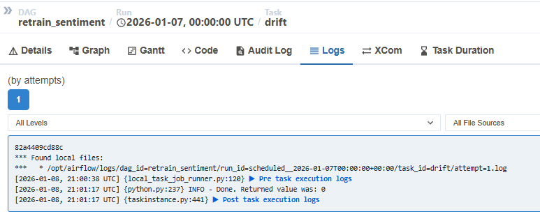

Airflow DAG `retrain_sentiment` in esecuzione senza drift rilevato. Mostra i task (ingest → drift → branch → train → evaluate_and_promote) completati con successo.

Quando viene rilevato data drift, il DAG innesca automaticamente il retraining:

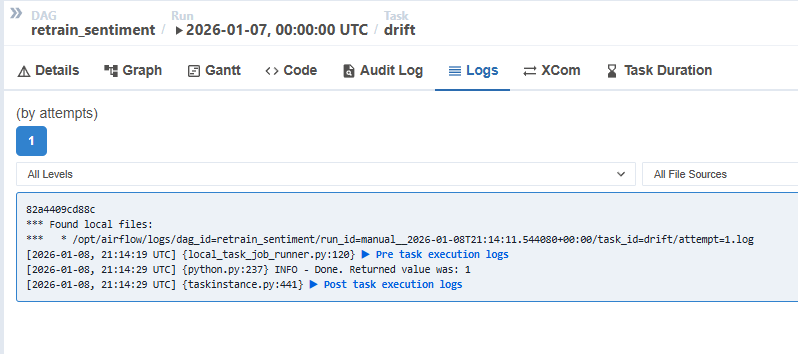
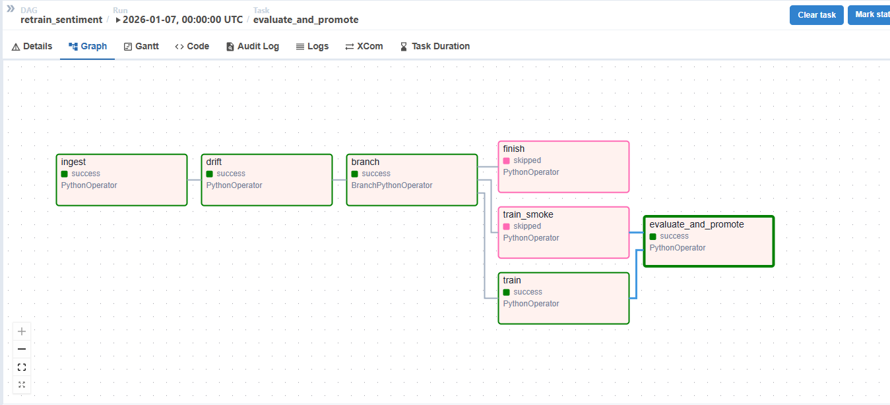

I log di ogni task mostrano il flusso di esecuzione, gli artefatti generati e i parametri passati al modello.

### Grafana Dashboard – Monitoraggio Continuo

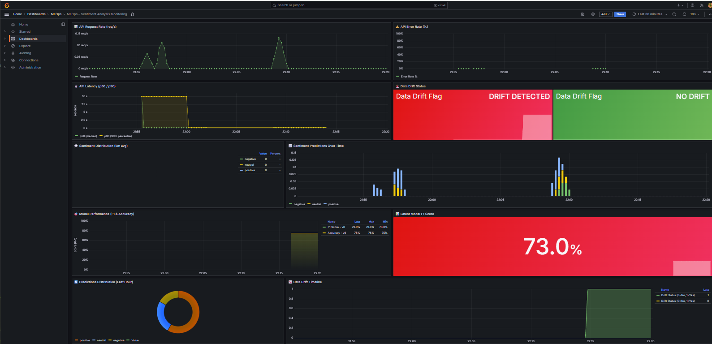

Dashboard principale "MLOps – Sentiment Analysis Monitoring" con visibilità continua su request volume, latency (p50/p90), sentiment distribution e metriche di performance del modello.

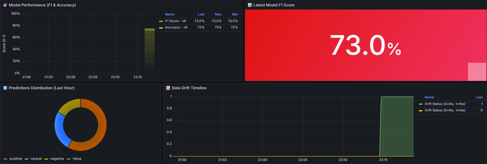

Metriche di performance del modello (F1 & Accuracy) aggiornate dopo ogni retraining.

**Data Drift Detection** (componente chiave della continuous monitoring):

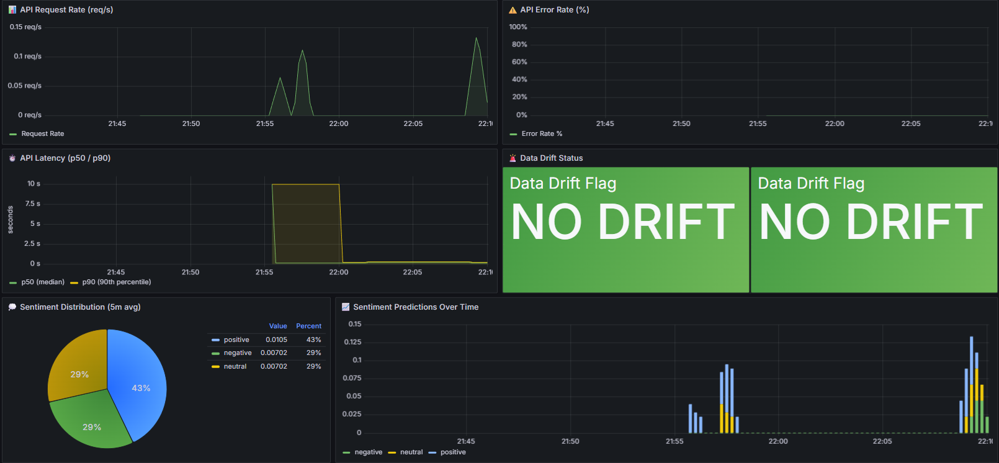

Nessun drift rilevato - il flag rimane a 0 (verde).

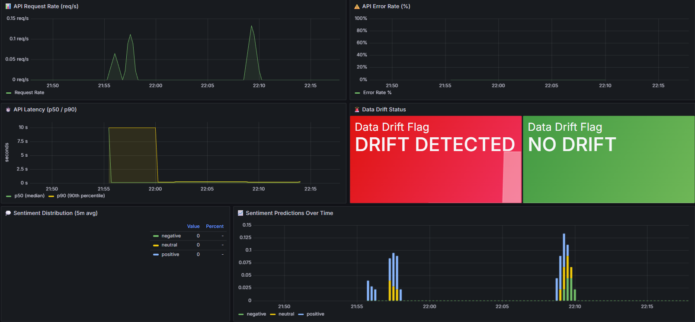

Quando viene rilevato data drift, il flag passa a 1 (rosso) e trigga automaticamente il retraining.

### MLflow Model Registry – Versioning e Stage Management

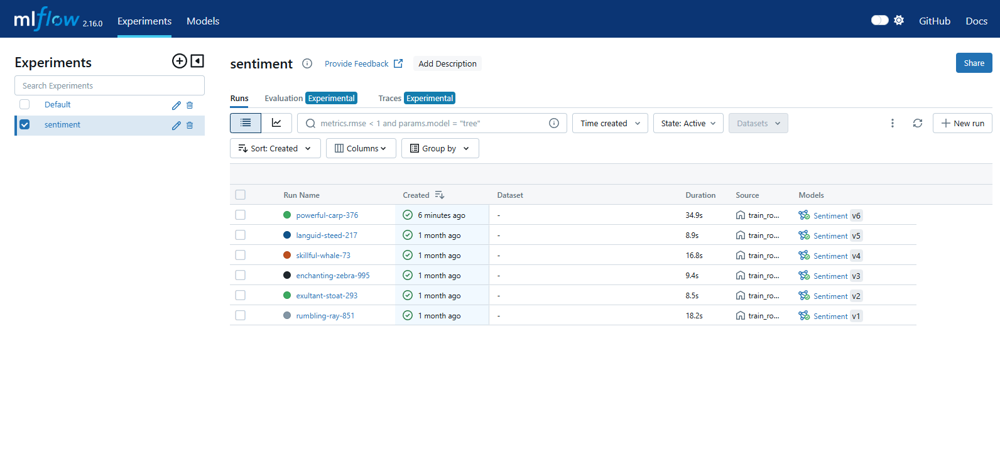

Model Registry con tutte le versioni del modello `Sentiment`. Mostra versioni registrate, stage corrente (Production/Staging/None) e parametri di ogni run. Automaticamente aggiornato dal DAG di Airflow durante valutazione e promozione.

### Prometheus – Time-Series Database per Metriche

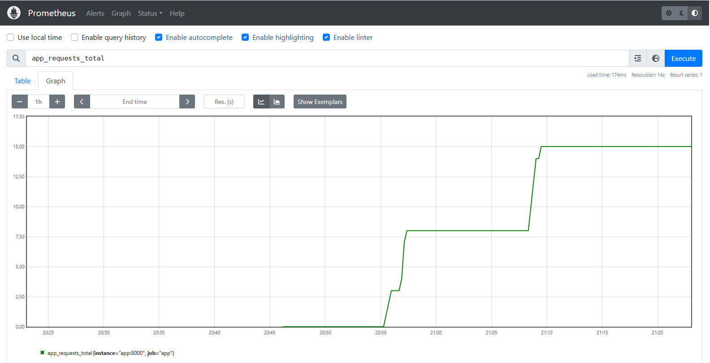

Database time-series che raccoglie tutte le metriche esposte da FastAPI: `app_requests_total`, `app_request_latency_seconds`, `app_sentiment_predictions_total`.

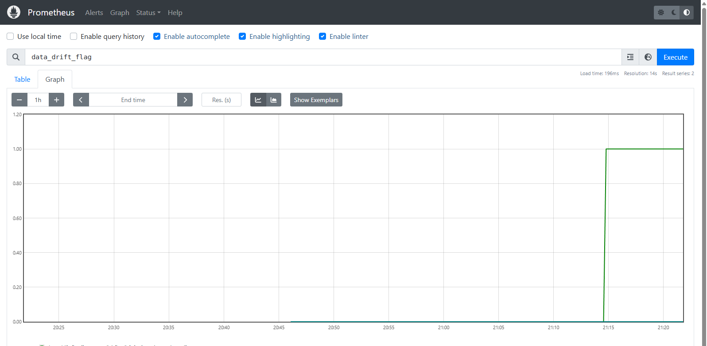

Metriche per il monitoring del drift: `data_drift_flag` (0=no drift, 1=drift rilevato).

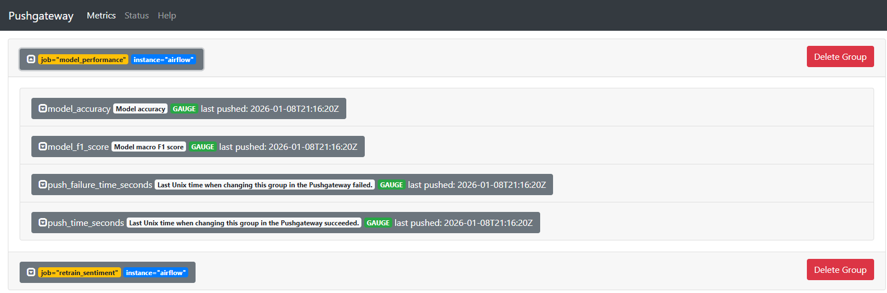

Il DAG di Airflow pushes le metriche di performance del modello (F1, accuracy) al Pushgateway, che le rende disponibili a Prometheus per la visualizzazione in Grafana.

### GitHub Actions CI/CD Pipeline

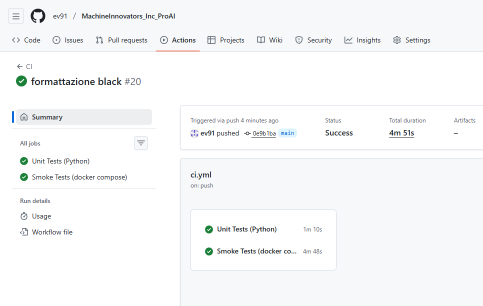

Pipeline CI/CD automatica eseguita su ogni push/PR con:
- **Linting** (ruff) – controlla la qualità del codice
- **Unit Tests** (pytest) – verifica la correttezza dei moduli
- **Smoke Test** (docker compose) – testa l'intero stack in containerization
- Utile come prova che la pipeline è funzionante e mantenuta

---

## 🔧 Comandi utili

### Cleanup completo
```bash
docker compose down --volumes --remove-orphans
docker system prune -f
```

### Visualizza i log di un servizio
```bash
docker compose logs -f app
docker compose logs -f airflow
docker compose logs -f mlflow
```

### Esecuzione delle singole task Airflow
```bash
# Ingest dati
docker compose exec airflow airflow tasks test retrain_sentiment ingest 2025-01-01

# Drift detection
docker compose exec airflow airflow tasks test retrain_sentiment drift 2025-01-01

# Training
docker compose exec airflow airflow tasks test retrain_sentiment train 2025-01-01
```

---

## 📝 Note sul timing

> Lo stack richiede **~60–90 secondi** per partire completamente (Airflow + MLflow + Grafana).
> La prima inferenza può impiegare **5–10 secondi** per il download e warm-up del modello HuggingFace;
> le successive sono **<1 secondo** perché la pipeline resta in memoria.

---

## 📜 Licenza e contributi

Progetto sviluppato per **Machine Innovators Inc.** come esercitazione MLOps.

Per domande o contributi, apri una issue su GitHub.
